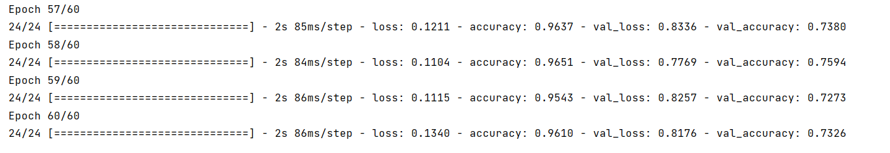
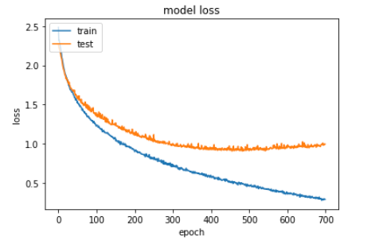
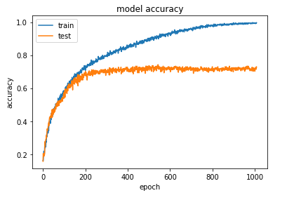
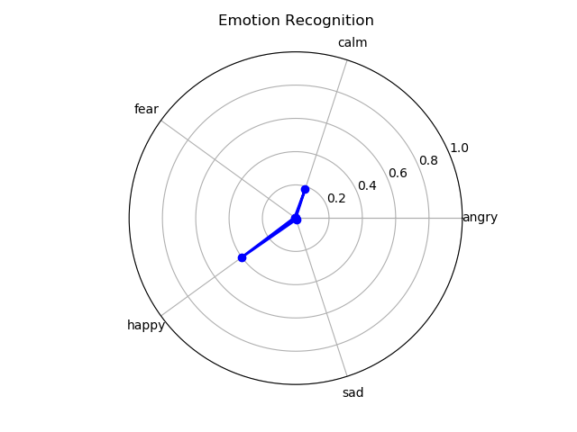

#### 1.Explain the problems and difficulties

- problems

  This module is to solve the problem of emotion recognition of audio. The specific description is as follows: Firstly, define the labels of two dimensions, namely gender (male and female) and emotion (angry, happy, SAD, calm and Fear). After we input an audio clip, we need to analyse the characteristics of the audio clip to predict which gender the audio comes from and which emotion it belongs to.  

- difficulties

  The complexity of emotion itself makes it very difficult to collect and sort out emotion speech data, which makes it difficult to obtain high-quality emotion corpus. For discrete emotion speech database, it is difficult to obtain speech that meets the requirement of corpus naturalness and emotion purity.  

  For the establishment of dimensional affective speech database, the difficulty lies not in the acquisition of corpus, but in the collation of corpus and the annotation of emotion. It is very difficult to label emotion in a large number of speech data sets.  

  The relationship between emotion and acoustic features: The initial difference between computer and human emotion recognition mechanism is the extraction of acoustic features related to emotion and the determination of the correlation between emotion and acoustic features. Therefore, if the computer can't accurately or as close as possible to the human way of emotional speech acoustic feature extraction and the correct association and mapping, will make computer speech emotion recognition system is established on the basis of a deviation from the actual, which leads to the following recognition mechanism and the gap between the human brain processing mechanism is more and more big, can't achieve the desired effect. At present, MFCCS is a good feature extraction method. At the same time, how to define the optimal extraction time of emotional acoustic features or fuse acoustic features of different time lengths also needs to be considered.  

#### 2.Model and Method

- data set-RAVDSS

  Due to the above mentioned "dimension of emotional speech database established" the difficulty, it is difficult for us to personally to arrange and emotion tagging corpus - because in this case, the individual subjective feelings may lead to emotional understanding deviation, caused from the training models and can't get accurate results (most people recognized the results). So we went through a lot of stuff on the Internet and finally found the RAVDESS English dataset that we are using now.  

   

  RAVDESS contains 7,356 files. The database consisted of 24 professional actors (12 women, 12 men) speaking two word-matching statements in a neutral North American accent. The speech included expressions of calm, happiness, sadness, anger, fear, surprise and disgust, each with two emotional levels (normal and strong), plus a neutral expression. In this project, we did not use the entire data set, but extracted five categories of calm, happiness, sadness, anger and fear, with an additional dimension of gender.  

  RAVDESS English data set[The Ryerson Audio-Visual Database of Emotional Speech and Song (RAVDESS) | Zenodo](https://zenodo.org/record/1188976#.Ycq0B2BBwuU)

  - 

- data processing method

  - MFCCS

  - process of extraction

    1) Pre-emphasis, frame and window the speech first;

    2) For each analysis window, obtain the corresponding spectrum through STFT;

       

       Where ![[formula]](https://www.zhihu.com/equation?tex=x%28m%29) is the input signal, is the window function, which is reversed in time and has an offset of n samples. ![[Formula]](https://www.zhihu.com/equation?tex=X%28n%2C%5Comega%29) is time ![[公式]](https://www.zhihu.com/equation?tex=n) and ![[公式]](https://www.zhihu.com/equation?tex=%5Comega)frequency! is a two-dimensional function that connects the time domain and frequency domain of the signal. We You can perform time-frequency analysis on the signal based on this, for example![[公式]](https://www.zhihu.com/equation?tex=S%28n%2C%5Comega%29%3D%7CX%28n%2C%5Comega%29%7C%5E2) is the so-called spectrogram of the speech signal.

    3) Pass the Mel filter bank on the above spectrum to get the Mel spectrum;

    4) Perform analysis on the Mel spectrum (take the logarithm and do the inverse transformation, the actual inverse transformation is generally realized by DCT discrete cosine transform, and take the 2nd to 13th coefficients after DCT as the MFCC coefficients), plus The energy becomes 13-dimensional, and the MFCC is obtained. This MFCC is the characteristic of this frame of speech;

       

       In this way, we process and crop each piece of audio to obtain a 216*13 MFCC feature vector.

- model

  The project selected the cnn1D one-dimensional convolutional neural network for prediction, and the detailed network architecture will not be analysed here. The general process is: averaging the feature vector of each processed audio on the 13th dimension to obtain a 216*1 vector, and use this as an input to train the model. After each round of training, an evaluation is performed to calculate the accuracy of the model to observe the convergence of the model. When the training is all completed, save the trained model for evaluation of large amounts of data and test of a single audio.

#### 3.Workflow

- create data

  We use the data set to create a Dataframe, where the format of the Dataframe is **<speech file path\speech classification label>**. The purpose of creating this list is to facilitate the reading of files during data preprocessing. Among them, our data set is an audio file in .wav format that has been labeled. The voice classification label refers to the five emotional dimensions of "angry", "sad", "happy", "calm" and "fear". And "male" and "female" two gender dimension labels. In the specific implementation process, in order to simplify the classification difficulty and reduce the training time, we combined gender and emotion into one dimension, so that we converted it into a multi-classification problem of 10 categories.

  ```python
  feeling_list=[]
  for item in mylist:
      if item[6:-16]=='02' and int(item[18:-4])%2==0:
          feeling_list.append('female_calm')
      elif item[6:-16]=='02' and int(item[18:-4])%2==1:
          feeling_list.append('male_calm')
      elif item[6:-16]=='03' and int(item[18:-4])%2==0:
          feeling_list.append('female_happy')
      elif item[6:-16]=='03' and int(item[18:-4])%2==1:
          feeling_list.append('male_happy')
      elif item[6:-16]=='04' and int(item[18:-4])%2==0;
  ......
  labels = pd.DataFrame(feeling_list)
  ```

  As shown in the figure above, the data is labeled in extract.py. After creating the DataFrame, we check the generated list file and modify the entries that caused the error, and finally get the following list containing the file path and the corresponding label.

  ```
  ,path,label
  0,test_list\female\03-01-02-01-01-01-02.wav,1
  1,test_list\female\03-01-02-01-01-01-04.wav,1
  2,test_list\female\03-01-02-01-01-01-06.wav,1
  3,test_list\female\03-01-02-01-01-01-08.wav,1
  ...
  ```

- process data

  After extract.py completes the creation of the data, we start to extract MFCC features from all the audio files in the training set, and store the resulting feature vectors in a .csv file to prepare for subsequent training.

  ```python
  df = pd.DataFrame(columns=['feature'])
  bookmark=0
  for index,y in enumerate(mylist):
      if mylist[index][6:-16]!='01' and mylist[index][6:-16]!='07' and mylist[index][6:-16]!='08' and mylist[index][:2]!='su' and mylist[index][:1]!='n' and mylist[index][:1]!='d':
          X, sample_rate = librosa.load('RawData/'+y, res_type='kaiser_fast',duration=2.5,sr=22050*2,offset=0.5)
          sample_rate = np.array(sample_rate)
          mfccs = np.mean(librosa.feature.mfcc(y=X, 
                                              sr=sample_rate, 
                                              n_mfcc=13),
                          axis=0)
          feature = mfccs
  ```

- train model

  Run train.py to start training the model, use a one-dimensional convolution model, and set the data input layer to [None, 216, 1]. In order to observe the convergence of the model and the prediction accuracy, we re-run the data after each epoch Chaos and evaluate. And after the training is completed, the model is saved as a .h5 file, which will be used for the evaluation of a large amount of test data and the prediction of a single voice.

  ```python
  model = Sequential()
  
  model.add(Conv1D(256, 5,padding='same',
                   input_shape=(216,1)))
  model.add(Activation('relu'))
  model.add(Conv1D(128, 5,padding='same'))
  ......
  model.add(Activation('relu'))
  model.add(Flatten())
  model.add(Dense(10))
  model.add(Activation('softmax'))
  opt = keras.optimizers.rmsprop(lr=0.00001, decay=1e-6)
  model.summary()
  model.compile(loss='categorical_crossentropy', optimizer=opt,metrics=['accuracy'])
  ```

  We remove the entire training part to avoid unnecessary long training

  ```python
  cnnhistory=model.fit(x_traincnn, y_train, batch_size=16, epochs=700, validation_data=(x_testcnn, y_test))
  ```

  The model parameters are shown below

  ```python
  # parameters
  epochs: 60
  batch_size: 32 
  lr: 0.001 
  
  n_kernels: 32
  kernel_sizes: [5, 5]
  dropout: 0.5
  hidden_size: 32
  ```

  The training process and the loss and accuracy obtained after each round in the model training process are shown in the figure below. It can be seen that the model converges significantly faster after 200 epochs.

  

  

  

- predict emotion with model

  Run the prediction function predict.py, first extract the MFCC features of the input audio and convert them to the required dimensions, and then extract the trained model. The trained model is used to predict the input audio, and the probability vector of the audio on each label is obtained. The sum of all the components in the probability vector is 1, and finding the label corresponding to the largest component in the vector is the result of our prediction. We show the prediction results through the radar chart, which is more clear.

  ```python
  def predict(wav_file, loaded_model):
      X, sample_rate = librosa.load(wav_file, res_type='kaiser_fast', duration=2.5, sr=22050 * 2, offset=0.5)
  ......
      livepreds = loaded_model.predict(twodim,
                                       batch_size=32,
                                       verbose=1)
      return livepreds
  ```

  ```python
  def Judge_render(livepreds):
      ifmale = 0
      iffemale = 0
      livepreds = livepreds.reshape(10, )
      for i in range(5):
          iffemale = iffemale + livepreds[i]
      for j in range(5, 10):
          ifmale = ifmale + livepreds[j]
      if ifmale > iffemale:
          return "male", livepreds[5:10]
      else:
          return "female", livepreds[0:5]
  ```

  

  > [[2.1368088e-01 4.1267309e-02 1.4035265e-07 3.3199336e-02 1.1228149e-01
  > 3.0333758e-05 1.8161860e-01 7.8319320e-03 4.0111807e-01 8.9718904e-03]] 
  > male

#### 4.Result analysis

We analyse the results of the constructed model, and calculate the accuracy, regression, f1-score, ROC, and AUC of the model. Different types of models may have different evaluation values due to different output formats.

We evaluate the model saved after training, and we choose a test set that is completely different from the training set. The test set contains a total of 959 audio files. Similarly, we first use extract.py to extract the <path/label> list, which is the real label of the audio file; at the same time, we store the audio file prediction result (label) in Another list. By processing and comparing these two lists in multiple dimensions, the above evaluation parameters are calculated.

> Micro precision 0.9103232533889468
> Micro recall 0.9103232533889468
> Micro f1-score 0.9103232533889468
>
> Each class ROC
> 0.9892936461954422
> 0.9964271919660099
> 0.9850086906141368
> 0.9914662997296253
> 0.9901264967168791
> 0.9944838740826574
> 0.9922392787524366
> 0.9900661452298185
> 0.9872175550405563
> 0.9778872151409811
>
> AUC: 0.989140679092956

It can be seen that the accuracy and regression rate of the model on the test set are very good, and the trained model is relatively good.

#### 5.Advantages and Disadvantages

This part is an excellent realization of voice emotion prediction and gender prediction, and the predicted probability is reflected through the visualized radar chart. At the same time, the one-dimensional convolutional neural network model obtained by training has good accuracy and regression rate on a large number of test sets, indicating that the model has a high prediction success rate and can effectively predict individual audio, which achieves our original goal . At the same time, this project also has certain defects. The first is that the length of the input audio is limited. Since emotion recognition requires that the input speech cannot be too short, the feature vectors are intercepted to 216 dimensions during model training. When the input audio features are less than 216 dimensions, prediction will not be possible . In addition, when the noise is large or the number of speakers is too large, the emotion prediction will be biased, because the voice may contain a variety of emotional characteristics and gender characteristics.