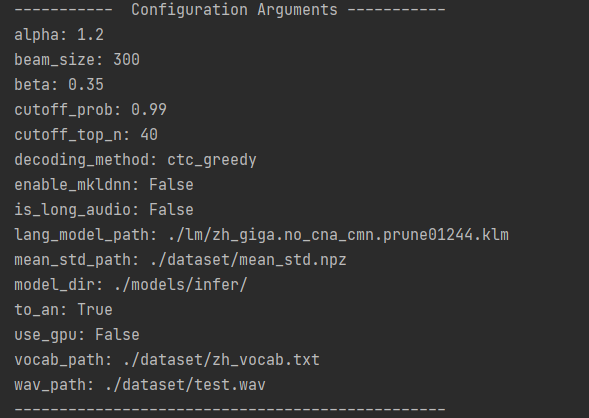

# Speech to text

#### 1.question and difficulties

The function of this module is relatively single, but the realization is relatively complicated. After the user inputs a piece of audio, according to the trained model, the audio is converted into text and displayed in front of the user. There are two difficulties, one is to obtain the audio signal of a single word from continuous audio, and the other is to select suitable words from the vocabulary to form a sentence based on a series of discrete sounds. The model trained by the system is the conversion of speech to language, that is, input a piece of audio, and after operations such as feature extraction and word segmentation, a language sequence is finally obtained.

#### 2.using dataset,data handling method,model and lossing funtion

##### dataset-free_st_chinese_mandarin_corpus

The free Chinese corpus provided by Surfingtech (www.surfing.ai) contains the voices of 855 speakers and 102,600 sentences. We compared three different data sets and found that the effect of free-st is relatively best. , There is a high probability that the entire sentence input by the user can be recognized, the error rate is low, and the adaptability to long speech is also relatively good. Here are two other data sets we tested

##### dataset-thchs30

THCHS-30 was recorded through a single carbon microphone in a quiet office environment, with a total duration of more than 30 hours. Most of the people involved in the recording are college students who can speak fluent Mandarin. The sampling frequency is 16kHz, and the sampling size is 16bits. It comes from Tsinghua University. The recorded content is mainly text or news. It is one of the open source libraries for Mandarin recognition in China.

##### dataset-aishell

Hill Shell's Mandarin Chinese voice database, text design, smart home, driverless, industrial production and other fields. Use microphones and mobile phones to record, and 400 speakers from different accent regions participated in the recording. After professional phonetic proofreaders write annotations. A total of 178 hours, 340 people in the training set, 20 people in the test set, and 40 people in the verification set. It is also one of the domestic open source libraries for Mandarin recognition.

After comparison, we finally choose free

##### data handling

After segmenting the audio, the features are extracted, and the label of the voice is combined with the voice data itself, which is convenient for calling during training.

First, sort the audio and put the short audio before the long audio, so that the system can give priority to training short audio. Training very deep networks from scratch (or rnn with many steps) may fail early in training because the output and radiation must be propagated through many untuned weight layers. Except for the explosion gradient. CTC usually ends up assigning a probability close to zero for very long transcriptions, which makes the gradient descent quite unstable. We use a course learning strategy called SortaGrad: We use the length of the utterance as a heuristic for difficulty, and train shorter (easier) utterances first.

Specifically, in the first training stage, we iterate the mini-batch in the training set in increasing order of the longest utterance length in the mini-batch. After the first epoch, training returns to random order in mini-batch. SortaGrad improves the stability of training and reduces training costs

##### model building

Use RNN recurrent neural network to build the model. The purpose of RNN is to process sequence data. In the traditional neural network model, from the input layer to the hidden layer and then to the output layer, the layers are fully connected, and the nodes between each layer are not connected. We predict what the next word of the sentence will be, and generally we need to use the previous word. RNNs are called recurrent neural networks, that is, the current output of a sequence is also related to the previous output. The specific form of expression is that the network will memorize the previous information and apply it to the calculation of the current output, that is, the nodes between the hidden layers are no longer unconnected but connected, and the input of the hidden layer not only includes the output of the input layer It also includes the output of the hidden layer at the previous moment. In theory, RNNs can process sequence data of any length.

In our network, there are a total of multiple convolutional input layers, plus a multi-layer RNN recurrent neural network for training. The realization of a recurrent layer is:
$$
h_t^l=f(W^lh_t^{l-1}+U^lh_{t-1}^l+b)
$$
Among them, the activation amount of layer l at time step t is determined by the activation amount of the previous layer $h_t^{l-1}$ at the same time step t and the current layer's activation amount at the previous time step $h_{t-1 }^l$ activation amount combined with calculation.

In order to effectively absorb data when expanding the training set, we increase the depth of the network by adding more loop layers. However, as the network size and depth increase, the use of gradient descent to train the network is prone to problems. We used the BatchNorm method to train deeper nets faster. Research shows that BatchNorm can speed up the convergence speed of rnn training. When applied to a very deep network of rnn on a large data set, BN greatly improves the final generalization error while accelerating training.

For each hidden unit, we calculate the mean and variance statistics of the sequence length of all items in the mini-batch to achieve batch standardization:
$$
h_t^l=f(B(W^lh_t^{l-1})+U^lh_{t-1}^l)
$$

##### lossing function-CTC

The CTC loss function gives the output distribution of all possible Y for a given X. You can use this distribution to infer a possible output or estimate the probability of a given output. Not all methods of calculating loss functions and performing reasoning are easy to handle. For a given input, we want to train our model to maximize the probability of assigning it to the correct answer.

Its basic idea is that its basic idea is to interpret the network output as a probability distribution of the overall possible label sequence, and the condition is a given input sequence. Given this distribution, an objective function can be derived to directly maximize the probability of the correct label.

It is found that the use of CTC is very unstable in the early stage of training, which affects the training of the final model. This is because training a very deep network from scratch (or rnn with many steps) may fail early in the training, because the output and gradient must be propagated through many untuned weight layers. Except for the explosion gradient. CTC usually finally assigns a probability of close to zero for very long transcriptions, which makes the gradient descent quite unstable, which is one of the reasons for the introduction of sortagrad.

#### 3.working flow

##### creating data,handling data

We should build a data generator for training data and testing data

~~~python
train_generator = DataGenerator(vocab_filepath=args.vocab_path,
                                mean_std_filepath=args.mean_std_path,
                                augmentation_config=augmentation_config,
                                max_duration=args.max_duration,
                                min_duration=args.min_duration,
                                place=place)
~~~

The parameters are passed through the format of the configuration file. The parameters of the generator are presets for the generator, including the input vocabulary, the file of the average standard value of the data set, and some data operations.

Then call the generator function to generate sub-batch training data and test data

~~~python
train_batch_reader = train_generator.batch_reader_creator(manifest_path=args.train_manifest,                                     			   batch_size=args.batch_size,                                                  	shuffle_method=args.shuffle_method)
~~~

In the data generator, the audio address and the audio corresponding text data are connected together to form a tuple

~~~python
inst = self.process_utterance(instance["audio_filepath"], instance["text"])
~~~

Information reading uses the fluid part of paddle to use its set_batch_generator function to pass in the data reader.

##### model training

Params:

batch_size:16

learning_rate:5e-4

max_duration:20.0

min_duration:0.5

mean_std_path:./dataset/mean_std.npz

num_conv_layer:2

num_epoch:50

num_rnn_layer:3

Use paddle for training, call paddle.static.Executor to generate a model trainer, and initialize it

~~~python
exe = paddle.static.Executor(self._place)
exe.run(startup_prog)
~~~

Then the training is performed and the training process data is saved

~~~python
fetch = exe.run(program=train_compiled_prog, fetch_list=[ctc_loss.name], return_numpy=False)
~~~

The returned FETCH contains the loss rate of training. After calculation, the loss of an EPOCH can be obtained and the time of a training can be calculated. The model was saved once after every 10,000 batches and once after each epoch until the end of the training.

##### Train model

When the speech prediction is needed, the audio file is loaded and preprocessed, including extracting audio features and obtaining some audio parameters  

~~~python
audio_feature = self.audio_process.process_utterance(audio_path)
audio_len = audio_feature.shape[1]
mask_shape0 = (audio_feature.shape[0] - 1) // 2 + 1
mask_shape1 = (audio_feature.shape[1] - 1) // 3 + 1
mask_max_len = (audio_len - 1) // 3 + 1
mask_ones = np.ones((mask_shape0, mask_shape1))
mask_zeros = np.zeros((mask_shape0, mask_max_len - mask_shape1))
mask = np.repeat(np.reshape(np.concatenate((mask_ones, mask_zeros), axis=1),
                            (1, mask_shape0, mask_max_len)), 32, axis=0)
~~~

The Paddleinfer paddle will then be used to generate Predictor and call it to predict the model

Once the data is bound, call Predictor's Run method

~~~python
self.predictor.run()
~~~

You can then get the output

~~~python
output_handle = self.predictor.get_output_handle(self.output_names[0])
~~~

The output that is returned here is a two-dimensional array and the predicted result is a two-dimensional sequence of probabilities, each row being the probability of each word that the current sound is likely to pick up. Take the column coordinates of the word with the highest probability in each row and form a one-dimensional list, called the maximum index of each row. Then take out the probability values corresponding to all the maximum indexes in the whole probability sequence table to form a one-dimensional list, which is called the maximum probability list. Process to remove empty indexes and consecutive identical indexes from the maximum index list (which removes most of the data). According to the ultimate maximum index table to the word dictionary to find the corresponding words of each index, connected together to form a sentence. Adding up all the maximum probabilities and dividing by the length of the maximum probability list gives the average accuracy per word of the sentence. This accuracy rate will be returned to the front end as the score of the speech prediction.

#### 4.result analysis

First, show some parameters in the prediction process.

Then print the result of recognition, recognition time and average accuracy per word of speech.  

Compared three models, thchs30 recognition effect is centered, around 70%, the correct and audio accuracy is better, but the pronunciation for words some relatively weak, may be due to the tsinghua university library contains a lot of proper nouns, including complex names, news language generally comparatively large difference with the actual life, so the identification results.  

Aishell use same accuracy is low, voice and data is too concentrated in specific areas, lack of life language voice and data, therefore easier to a phoneme in training and rare combination of synthesis for words at ordinary times, and can't identify the situation of the words it produces words generated situation, lead to the resulting low voice and data accuracy.  

The free-ST model has a good effect, but it has high requirements on the pronunciation of words, and the accuracy rate is about 90%. It supports the recognition of some proper nouns and has a large reserve of words. It is the training set and training model that we finally use.  

#### 5.advantages and disadvantages

The speed of text transfer is fast, and the results can be obtained quickly after the audio is imported. The trained model can be imported quickly, and the model can be switched by changing a few simple file paths, which is convenient for users to use and manage. The predictive training process has strong controllability, and code generation and assembly is carried out through configuration, so that users do not need to find a needle in a haystack in the code, but meet the requirements of the modified model generation and use through the modification of config.

Turn words cannot reach the correct level of commercial, correct remains to be improved, the lack of noise reduction operation, you can use the related algorithm for noise reduction, voice input to support voice transfer text in noisy environment, higher requirements for input audio, does not support dialect, these are all after we can start to research and perfect direction.

