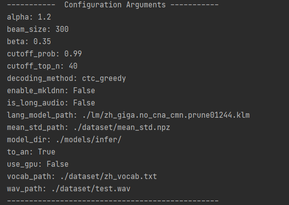

# 语音转文字

#### 1.问题与难点

本模块功能相对单一，但是实现相对复杂。用户输入一段音频后，根据已经训练好的模型，将音频转化为文字，并将其显示在用户面前。难点有二，一是从连续音频中获取单个词的音频信号，二是根据一串离散的音从词汇表中选择出合适的词组成一句话。系统训练的模型为语音转为语言，也就是输入一段音频，经过提取特征，分词等等操作，最终得到一段语言序列。

#### 2.所利用的数据集、数据处理方法、模型、损失函数

##### 数据集-free_st_chinese_mandarin_corpus

Surfingtech (www.surfing.ai)提供的免费汉语语料库，包含855个说话者的声音，102600句话，我们使用三个不同的数据集进行了对比，之后发现free-st的效果相对来说最好，有较大概率可以识别出用户输入的整段话，出错率较低，同时对于长语音也有比较好的适应性。下文介绍我们测试过的另外两个数据集

##### 数据集-thchs30

THCHS-30是在安静的办公室环境下，通过单个碳粒麦克风录取的，总时长超过30个小时。大部分参与录音的人员是会说流利普通话的大学生。采样频率16kHz，采样大小16bits。它来自清华大学，录制的内容主要都是课文或者新闻，是国内普通话识别的开源库之一。

##### 数据集-aishell

希尔贝壳中文普通话语音数据库，文本设计智能家居、无人驾驶、工业生产等多个领域。使用麦克风、手机进行录制，且有400名来自不同口音地区的发言人参与录制。经过专业语音校对人员撰写标注。共计178小时，训练集340人，测试集20人，验证集40人，也是国内普通话识别开源库之一。

经过比较，最终我们选用free

##### 数据处理

将音频分段后提取特征，并将语音的标签与语音数据本身结合，方便训练时的调用。

首先将音频进行排序，将短音频置于长音频之前，这样系统可以优先训练段短音频。从无到有地训练非常深的网络(或具有许多步骤的rnn)可能会在训练的早期失败，因为输出和辐射必须通过许多未调优的权值层进行传播。除了爆炸梯度。CTC通常最终为非常长的转录分配接近零的概率，这使得梯度下降相当不稳定。我们使用了称为SortaGrad的课程学习策略:我们使用话语的长度作为难度的启发式，并首先训练较短(较容易)的话语。

具体来说，在第一个训练阶段，我们按照小批量中最长话语长度的递增顺序在训练集中迭代小批量。在第一个epoch之后，训练在小批量上恢复到随机顺序。SortaGrad提高了训练的稳定性，降低了训练成本

##### 模型构建

使用RNN循环神经网络进行模型的构建生成。RNN的目的使用来处理序列数据。在传统的神经网络模型中，是从输入层到隐含层再到输出层，层与层之间是全连接的，每层之间的节点是无连接的。我们预测句子的下一个单词是什么，一般需要用到前面的单词。RNNs之所以称为循环神经网路，即一个序列当前的输出与前面的输出也有关。具体的表现形式为网络会对前面的信息进行记忆并应用于当前输出的计算中，即隐藏层之间的节点不再无连接而是有连接的，并且隐藏层的输入不仅包括输入层的输出还包括上一时刻隐藏层的输出。理论上，RNNs能够对任何长度的序列数据进行处理。

在我们的网络中，共有多个卷积输入层，外加多层RNN循环神经网络进行训练，一个循环层的实现为:
$$
h_t^l=f(W^lh_t^{l-1}+U^lh_{t-1}^l+b)
$$
其中，l层在时间步长t的激活量是由前一层$h_t^{l-1}$在同一时间步长t的激活量与当前层在前一时间步长$h_{t-1}^l$的激活量结合计算得到的。

为了在扩展训练集时有效地吸收数据，我们通过添加更多的循环层来增加网络的深度。然而，随着网络尺寸和深度的增加，使用梯度下降训练网络容易出现问题。我们使用了批处理标准化(BatchNorm)方法，以更快地训练更深的网。研究表明，BatchNorm可以加快rnn训练的收敛速度，当应用于大数据集上的rnn的非常深的网络时，BN在加速训练的同时，大大提高了最终的泛化误差。

对于每个隐藏单元，我们计算小批量中所有项目在序列长度上的均值和方差统计量以实现批处理标准化：
$$
h_t^l=f(B(W^lh_t^{l-1})+U^lh_{t-1}^l)
$$


##### 损失函数-CTC函数

CTC损失函数对于给定的X，给出所有可能Y的输出分布。可以用这个分布来推断一个可能的输出或者评估一个给定输出的概率。并不是所有计算损失函数和执行推理的方法都是容易处理的。对于给定的输入，我们希望训练我们的模型，使其分配给正确答案的概率最大化。

它的基本思想是其基本思想是将网络输出解释为一个概率分布的整体可能的标签序列，条件是给定的输入序列。给定这个分布，可以推导出一个目标函数，直接使正确标签的概率最大化。

在训练的早期发现使用CTC十分不稳定，影响了最终模型的训练。这是因为从头开始训练非常深的网络(或具有许多步骤的rnn)可能会在训练的早期失败，因为输出和梯度必须通过许多未调优的权值层传播。除了爆炸梯度。CTC通常最终为非常长的转录分配接近零的概率，这使得梯度下降相当不稳定，这也是引入sortagrad的原因之一。

#### 3.工作流

- 创建数据、数据处理

  我们首先对训练数据和测试数据分别构造一个数据生成器

  ```python
  train_generator = DataGenerator(vocab_filepath=args.vocab_path,
                                  mean_std_filepath=args.mean_std_path,
                                  augmentation_config=augmentation_config,
                                  max_duration=args.max_duration,
                                  min_duration=args.min_duration,
                                  place=place)
  ```

  通过配置文件的格式进行参数传递，生成器的参数是对生气器的预设，包括传入词汇表、数据集均值标准值的文件，以及一些数据操作。

  之后调用生成器函数生成分batch的训练数据和测试数据

  ```python
  train_batch_reader = train_generator.batch_reader_creator(manifest_path=args.train_manifest,                                     			   batch_size=args.batch_size,                                                  	shuffle_method=args.shuffle_method)
  ```

  在数据生成器中，将音频的地址与音频对应文本的数据连接在一起，形成一个元组

  ```python
  inst = self.process_utterance(instance["audio_filepath"], instance["text"])
  ```

  信息读取使用paddle的fluid部分使用它的set_batch_generator函数将数据读取器传入。

- 模型训练

  相关参数：

  batch_size:16

  learning_rate:5e-4

  max_duration:20.0

  min_duration:0.5

  mean_std_path:./dataset/mean_std.npz

  num_conv_layer:2

  num_epoch:50

  num_rnn_layer:3

  使用paddle进行训练，调用paddle.static.Executor生成模型训练器，并对其进行初始化

  ```python
  exe = paddle.static.Executor(self._place)
  exe.run(startup_prog)
  ```

  之后执行训练并保存训练的过程数据：

  ```python
  etch = exe.run(program=train_compiled_prog, fetch_list=[ctc_loss.name], return_numpy=False)
  ```

  返回的fetch中包含了训练的损失率，经过计算可以得到一个epoch的损失，并计算出一次训练的时间。每经过10000个batch保存一次模型，每一个epoch也保存一次模型，直到训练结束。

- 模型使用

  需要进行语音预测时加载音频文件并对其进行预处理，包括提取音频特征，获取音频的一些参数

  ```python
  audio_feature = self.audio_process.process_utterance(audio_path)
  audio_len = audio_feature.shape[1]
  mask_shape0 = (audio_feature.shape[0] - 1) // 2 + 1
  mask_shape1 = (audio_feature.shape[1] - 1) // 3 + 1
  mask_max_len = (audio_len - 1) // 3 + 1
  mask_ones = np.ones((mask_shape0, mask_shape1))
  mask_zeros = np.zeros((mask_shape0, mask_max_len - mask_shape1))
  mask = np.repeat(np.reshape(np.concatenate((mask_ones, mask_zeros), axis=1),
                              (1, mask_shape0, mask_max_len)), 32, axis=0)
  ```

  之后将使用paddle的paddleinfer，生成predictor，并调用predictor进行模型的预测

  需要将数据绑定后，调用predictor的run方法

  ```python
  self.predictor.run()
  ```

  之后即可获取输出

  ```python
  output_handle = self.predictor.get_output_handle(self.output_names[0])
  ```

  这里返回的输出是一个二维数组预测的结果是一个二维概率序列，每一行是当前的音可能取到的每一个字的概率。取出每一行中最大概率的字的列坐标，组成一个一维列表，称作每一行的最大索引。再取出整个概率序列表中所有最大索引对应的概率值，组成一个一维列表，称作最大概率列表.进行加工，去除最大索引列表中的空索引和连续的相同索引（这会去掉大部分数据）.根据最终的最大索引表到词汇字典中查出每个索引对应的字，连起来就组成了一句话.而将所有的最大概率加起来再除以最大概率列表的长度，就得到了整句话平均每个字的正确率。这个正确率将作为本次语音预测的得分返回前端。

#### 4.结果分析



首先显示预测过程中的一些参数。


而后打印识别的结果，识别消耗的时间以及语音的平均每字准确率。

三种模型比较，thchs30识别效果居中，正确率在70%上下，且音频准确率较好，但是读音获取文字部分相对较弱，可能是由于清华语音库中含有大量的专有名词，包括复杂的人名，新闻用语一般与实际生活相差较大，因此识别结果不佳。

aishell使用正确率同样较低，语音数据过于集中在特定领域，缺乏生活用语的语音数据，因此在训练时某音素更容易与平时少见的组合合成为词语，而不能识别出词语的情况它就会产生单字生成的情况，导致最终生成的语音数据准确率低下。

free-st模型效果较好，但对文字发音要求较高，正确率在90%左右，支持部分专有名词的识别，词语储量较大，是我们最终使用的训练集以及训练模型。

#### 5.优点缺点

转文字部分速度较快，可以在导入音频后迅速的得出结果，可以将训练好的模型快速导入，通过改变几个简单的文件路径就能够实现模型的切换，方便用户的使用和管理。预测训练过程可控性强，通过配置的方式进行代码的生成装配，用户无需在代码中大海捞针，而是通过config的修改达到修正模型产生使用的要求。

转文字正确率不能达到商用级别，正确率有待提高，缺乏降噪的操作，可以使用相关算法对语音输入进行降噪，以支持在嘈杂环境中的语音转文字，对于输入音频要求较高，不支持方言，这些都是我们之后可以着手研究和完善的方向。

