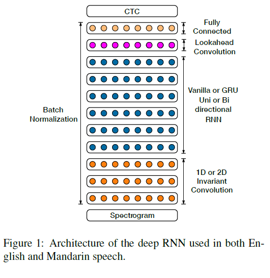
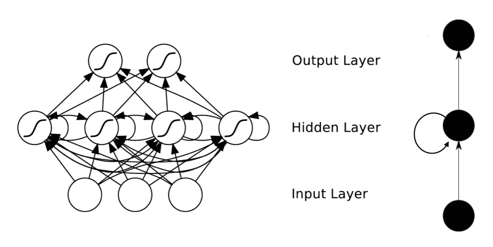
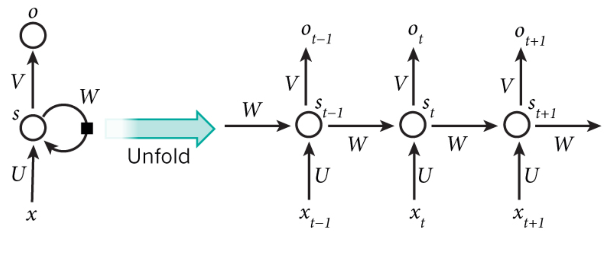
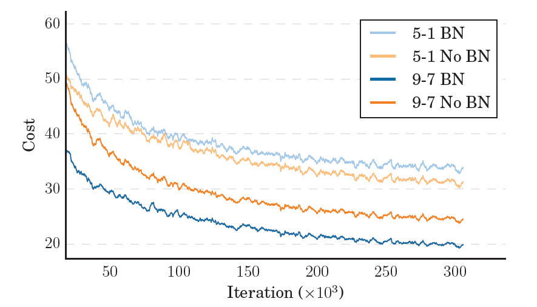

## 模型训练或语音识别过程

模型使用了RNN（循环神经网络），这是论文中的RNN架构图，有一个或多个卷积输入层。

### RNN简单介绍

​	**RNN**的目的使用来处理序列数据。在传统的神经网络模型中，是从输入层到隐含层再到输出层，层与层之间是全连接的，每层之间的节点是无连接的。但是这种普通的神R经网络对于很多问题却无能无力。例如，你要预测句子的下一个单词是什么，一般需要用到前面的单词，因为一个句子中前后单词并不是独立的。RNNs之所以称为循环神经网路，即一个序列当前的输出与前面的输出也有关。具体的表现形式为网络会对前面的信息进行记忆并应用于当前输出的计算中，即隐藏层之间的节点不再无连接而是有连接的，并且隐藏层的输入不仅包括输入层的输出还包括上一时刻隐藏层的输出。理论上，RNNs能够对任何长度的序列数据进行处理。但是在实践中，为了降低复杂性往往假设当前的状态只与前面的几个状态相关，下图便是一个典型的RNNs：

https://blog.csdn.net/heyongluoyao8/article/details/48636251

上面 是介绍RNN的博客，我也没仔细看，需要的话我可以在周四前找时间研究一下

上图为使用BN和不使用BN的系统开销对比（BN就是BatchNorm，下一段有介绍）

作者为了在拓展训练集时有效的吸收数据，通过添加更多循环层增加网络的深度，但这使得梯度下降训练网格更困难，作者采用了**批处理标准化（BatchNorm）**的变体来加速训练。

使用**CTC损失函数**对网络进行端到端的训练，作者发现偶尔并不稳定，因此作者使用了他们（指作者）称为**SortaGrad的课程学习策略**：将话语的长度作为难度的启发式，并首先训练较短的话语。具体来说，在第一个训练阶段，按照小批量中最长话语长度的递增顺序在训练集中迭代小批量。在第一个epoch之后，训练在小批量上恢复到随机顺序。

==预测的原理我实在没找到，哎，我感觉应该它就是有了模型之后，把音频放入模型，模型自己就会跑出对应的结果吧，跟paddle的predictor没啥关系，可能主要还是在模型的构建上。沈莹当时说模型可以抄，那咱们稍微了解一下这个模型训练 的过程和用到的方法应该就可以了==

## predict结束后（解码，实际上语言模型和语音模型都在paddle中）

这里只是根据已有的概率把字识别出来，更像是取舍翻译的过程

刘昕宇的理解：

1. 预测的结果是一个二维概率序列，每一行是当前的音可能取到的每一个字的概率。
2. 对于这个序列适用**贪婪**的方法进行处理
3. 取出每一行中最大概率的字的列坐标，组成一个一维列表，称作每一行的最大索引。
4. 再取出整个概率序列表中所有最大索引对应的概率值，组成一个一维列表，称作最大概率列表。
5. 进行加工，去除最大索引列表中的空索引和连续的相同索引（这会去掉大部分数据）
6. 根据最终的最大索引表到词汇字典中查出每个索引对应的字，连起来就组成了一句话
7. 而将所有的最大概率加起来再除以最大概率列表的长度，就得到了整句话平均每个字的正确率。
8. 这个正确率就是最后预测输出的**score**

tips：

输入到网络的是功率归一化音频剪辑的对数谱图序列，按20ms窗口计算。输出是每种语言的字母表。在每个输出时间步长t处，RNN进行预测$p(l_t|x)$，其中$l_t$是字母表中的一个字符或空白符号。——引自作者论文