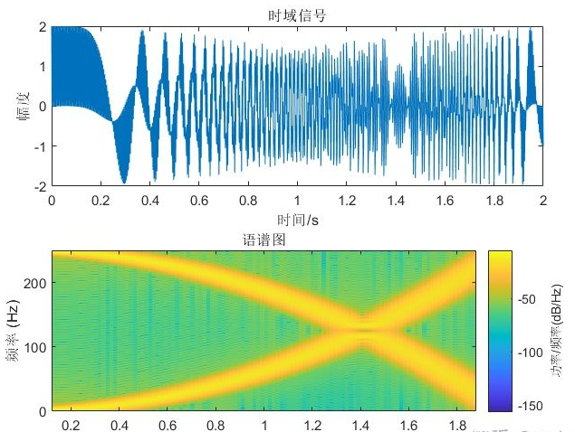
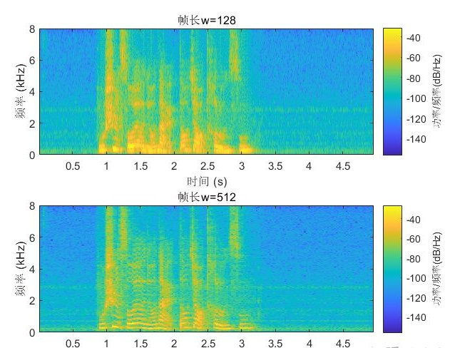
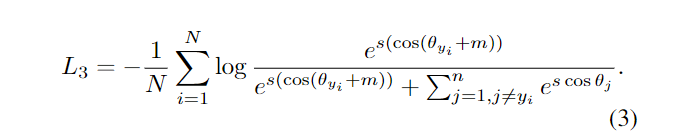
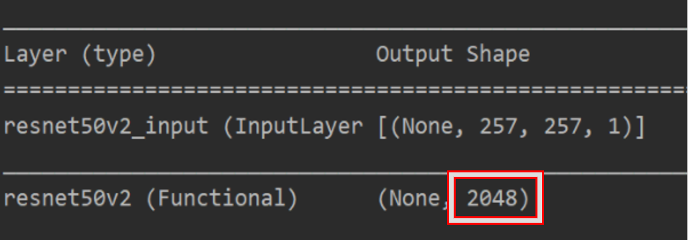

# 项目文档

文档大概每个人的部分分成这几个模块：
1.阐述一下解决的问题与难点 
2.所利用到的数据集、数据处理方法、模型、损失函数等 可以稍微详细一点点 神经网络部分可以从简 主要说清楚用这些方法来干什么 为什么要用 作用是什么 为什么用别的不行 
3.工作流 可以贴一些重要代码 从数据处理到训练、评估流程走一遍 都用了哪些部分的代码文件（这是要求里面有的）可以贴一下你们自己部分的运行结果
4.结果分析（如果有的话）简要分析一下模型准确率等等参数 
5.优点缺点 比如模型对什么数据识别度高 什么类型的数据识别度低 语音转文字可以说一下不同数据计算训练出来的模型的优缺点等等 自己想一想总结一下 然后加一些TODO 就是我们的模型哪些功能还需要进一步优化


#### 1. 阐述一下解决的问题与难点 

本模块为声纹对比系统，即对输入的两端语音进行声纹解析，判断二者是否为同一个人的语音，并且给出两语音的相似程度。我们最初的思路是构建预测声纹的深度学习模型，但是在测试的时候我们发现模型无法预测训练集外的声纹，因此又对模型进行了简单修改，不需要预测声纹所属即可计算出语音声纹相似度。后文讲对这两个模型进行解释与分析。

此部分的主要难点在于构建预测模型以及导出特征矩阵并对其进行相似度计算。

This module is a voiceprint comparison system, that is to analyze the voiceprint of the two ends of the input voice, judge whether they are the same person's voice, and give the degree of similarity between the two voices. Our initial idea was to build a deep learning model to predict the voiceprint. However, when testing, we found that the model could not predict the voiceprint outside the training set. Therefore, we simply modified the model to calculate the voice print similarity without predicting the voice print's ownership. These two models are explained and analyzed in the following part.  

The main difficulty of voiceprint comparison system lies in the construction of the prediction model and the derivation of the feature matrix and the calculation of its similarity.  

#### 2. 所利用到的数据集、数据处理方法、模型、损失函数等 可以稍微详细一点点 神经网络部分可以从简 主要说清楚用这些方法来干什么 为什么要用 作用是什么 为什么用别的不行 

本部分简要阐述所用到的数据集、数据处理、模型选取以及损失函数等主要模型构建方法，将对模型与各个方法选取过程中的效果进行权衡分析与比较。

------

- Dataset-Zhvoice

  本模块所用到的数据集为Zhvoice中文语料库，此数据集一共有3242个人的语音数据，有1130000+条语音数据。相较于其他数据集，该数据集对任务进行了标签处理，数据量较大，人物数量能够满足模型的训练需求。

  The data set used in this module is Zhvoice Chinese corpus, which has a total of 3242 individual voice data, including 1,130,000 + voice data. Compared with other data sets, this data set labels tasks and has a large amount of data, and the number of characters can meet the training requirements of the model.

- Data Processing-STFT

  Short-Time Fourier Transform, STFT, which is defined as:

  ![[公式]](https://www.zhihu.com/equation?tex=X%28n%2C%5Comega%29%3D%5Csum_%7Bm%3D-%5Cinfty%7D%5E%5Cinfty+x%28m%29w%28n-m%29e%5E%7B-j%5Comega+m%7D)

  Among the formula,  ![[公式]](https://www.zhihu.com/equation?tex=x%28m%29) is the input signal， ![[公式]](https://www.zhihu.com/equation?tex=w%28m%29) is the window function，it reverses in time and has an offset of n samples. ![[公式]](https://www.zhihu.com/equation?tex=X%28n%2C%5Comega%29) is a two-dimensional function of time ![[公式]](https://www.zhihu.com/equation?tex=n) and frequency ![[公式]](https://www.zhihu.com/equation?tex=%5Comega) , it connects the time domain and frequency domain of the signal, and we can analyze the time frequency of the signal, for instance, ![[公式]](https://www.zhihu.com/equation?tex=S%28n%2C%5Comega%29%3D%7CX%28n%2C%5Comega%29%7C%5E2) is a speech signal called a spectrogram.

  The following figure shows the spectrogram of two sweep signals after superposition.

  

  It can be seen that the signal is the superposition of a 0-250Hz twice increasing sweep signal and a 250-0Hz twice decreasing sweep signal. By STFT, we can easily obtain the time-varying characteristics of non-stationary signals.

  Different window lengths are used in spectral calculation ![[公式]](https://www.zhihu.com/equation?tex=S%28n%2C%5Comega%29) , Two kinds of spectrograms, narrowband and wideband, can be obtained. Long time Windows (at least two pitch periods) are often used to calculate narrowband spectrograms, while short Windows are used to calculate broad-band spectrograms. Narrowband speech spectrogram has high frequency resolution and low time resolution. With good frequency resolution, each harmonic component of speech can be more easily identified and displayed as horizontal fringe on speech spectrogram. On the contrary, broadband spectrogram has high time resolution and low frequency resolution. Low frequency resolution can only obtain spectral envelope, and good time resolution is suitable for analyzing and testing Chinese pronunciation.

  As shown below, the spectrograms of a speech with frame length 128 and 512 are respectively.

  

  It can be seen that for the STFT with fixed frame length, the time resolution and frequency resolution are fixed in the global scope.

  We then processed the audio data set, converting the audio to a 257*257 STFT amplitude spectrum.

- Model specification-Resnet

  Resnet-50 residual neural network is selected for prediction in the project. Detailed network architecture is not analyzed here. The following figure shows the network architecture and input and output shape.

  ```python
  Model: "Resnet-50"
  _________________________________________________________________
  Layer (type)                 Output Shape              Param #   
  =================================================================
  resnet50v2_input (InputLayer [(None, 257, 257, 1)]     0         
  _________________________________________________________________
  resnet50v2 (Functional)      (None, 2048)              23558528  
  _________________________________________________________________
  batch_normalization (BatchNo (None, 2048)              8192      
  =================================================================
  Total params: 23,566,720
  Trainable params: 23,517,184
  Non-trainable params: 49,536
  ```

  At the end of each training round, model evaluation was performed to calculate the accuracy of the model and observe the convergence of the model. Similarly, the model is saved once at the end of each round of training, and the model parameters that can be restored to training are saved respectively, which can also be used as pre-training model parameters. The prediction model is also saved for later prediction.

- Loss function-ArcFace

  ArcFace is published by Imperial College London in January 2018. Based on Sphere Face, it improves the normalization and additive Angle interval of feature vectors, improves the separability between classes, and strengthens the intra-class compactness and differences between classes. ArcFace has the advantages of high performance, easy programming, low complexity and high training efficiency. For the normalization of eigenvectors and weights, for θ plus the Angle interval m, the Angle interval has more direct effect on angles than the cosine interval.

  As the embedding features are distributed around each feature Centre on the hypersphere, we add an additive angular margin penalty m between xi and Wyi to simultaneously enhance the intra-class compactness and inter-class discrepancy. Since the proposed additive angular margin penalty is equal to the geodesic distance margin penalty in the normalized hypersphere, we name our method as ArcFace.

  

- Refactoring model-Diagonal cosine

  In the problem brief and difficult parts, we found the following problems: Due to the limitation of training data set, we could not compare our own voice with more diverse voices, and we could not give the similar relationship between the two voices. Therefore, we reconstructed the model. Instead of predicting the input speech, we compared the output eigenvalues in the process of the model.

  

  That is, in the feature matrix with the output dimension of (2048, 1) in the residual neural network, we only need to solve the diagonal cosine value of the two input speech feature values to the similarity, and then set the threshold value to judge whether the two audio is from the same person.
  $$
  dist=\frac{np.dot(feature1, feature2)}{np.linalg.norm(feature1) * np.linalg.norm(feature2)}
  $$


#### 3. 工作流 可以贴一些重要代码 从数据处理到训练、评估流程走一遍 都用了哪些部分的代码文件（这是要求里面有的）可以贴一下你们自己部分的运行结果

此部分将结合代码中主要函数，简述模型的架构以及工作流，每个模型将从数据构建、数据处理到模型训练几个步骤进行分析与解释。

------

- 创建数据

  我们将利用数据集创建一个数据列表，数据列表的格式为`<语音文件路径\t语音分类标签>`，创建这个列表主要是方便之后的读取，也是方便读取使用其他的语音数据集，语音分类标签是指说话人的唯一ID，不同的语音数据集，可以通过编写对应的生成数据列表的函数，把这些数据集都写在同一个数据列表中。

  We will use the data set to create a data list, the format of the data list is`< speech file path \t speech classification label > `, the creation of this list is mainly for the convenience of reading later, but also for the convenience of reading using other speech data sets, speech classification label refers to the unique ID of the speaker, different speech data sets, we can write these datasets in the same data list by writing the corresponding functions that generate the data list.

  在create_data.py中进行数据标签处理，由于mp3格式的音频读取速度较慢，因此要把全部的mp3格式的音频转换为wav格式，在创建数据列表之后，可能有些数据的是错误的，所以我们要检查一下，将错误的数据删除。执行下面程序完成数据准备。形成了如下数据格式与标签。

  Data label processing in the create_data.py, because mp3 format audio reading speed is slow, so to convert all mp3 format audio to WAV format, after creating the data list, some data may be wrong, so we want to check, delete the wrong data. Perform the following procedure to complete the data preparation. The following data formats and labels are formed.

  ```
  Speech-Recognition-Final-Project/5_895/5_895_20170614203758.wav	3238
  Speech-Recognition-Final-Project/5_895/5_895_20170614214007.wav	3238
  Speech-Recognition-Final-Project/5_941/5_941_20170613151344.wav	3239
  Speech-Recognition-Final-Project/5_941/5_941_20170614221329.wav	3239
  Speech-Recognition-Final-Project/5_941/5_941_20170616153308.wav	3239
  Speech-Recognition-Final-Project/5_968/5_968_20170614162657.wav	3240
  ```

- Data processing

  有了上面创建的数据列表和均值标准值，就可以用于训练读取。主要是把语音数据转换短时傅里叶变换的幅度谱，并在此步骤进行数据增强，如随机翻转拼接，随机裁剪。经过处理，最终得到一个257*257的短时傅里叶变换的幅度谱。

  With the data list and mean standard values created above, it can be used for training reads. The speech data is mainly converted into the amplitude spectrum of short-time Fourier transform, and data enhancement is carried out in this step, such as random turnover splicing, random clipping. After processing, we get a 257 by 257 STFT amplitude spectrum.

  ```python
  # STFT
  wav, sr_ret = librosa.load(audio_path, sr=sr)
  linear = librosa.stft(extended_wav, n_fft=n_fft, win_length=win_length, hop_length=hop_length)
  linear_T = linear.T
  mag, _ = librosa.magphase(linear_T)
  mag_T = mag.T
  ```

- Model training

  运行train.py开始训练模型，使用tensorflow的resnet50模型，数据输入层设置为[None, 1, 257, 257]，即短时傅里叶变换的幅度谱的shape。为了更好的观测模型训练效果并节省训练时间，每训练一轮结束之后，执行一次模型评估，计算模型的准确率，以观察模型的收敛情况。同样的，每一轮训练结束保存一次模型，分别保存了可以恢复训练的模型参数，也可以作为预训练模型参数。

  Run train.py to start training the model, using RESnet50 model oftensorflow, and set the data input layer to [None, 1, 257, 257], that is, the shape of the amplitude spectrum of the STFT. In order to better observe the training effect of the model and save the training time, model evaluation was performed after each training round to calculate the accuracy of the model and observe the convergence of the model. Similarly, the model is saved once at the end of each round of training, and the model parameters that can be restored to training are saved respectively, which can also be used as pre-training model parameters.

  ```python
  def create_model(input_shape):
      # Build model
      model = tf.keras.Sequential()
      model.add(ResNet50V2(input_shape=input_shape, include_top=False, weights=None, pooling='max'))
      model.add(BatchNormalization())
      model.add(Dense(units=512, kernel_regularizer=tf.keras.regularizers.l2(5e-4), name='feature_output'))
      model.add(ArcNet(num_classes=args.num_classes))
      return model
  ```

  These are some parameters of the model.

  | params                | num           |
  | --------------------- | ------------- |
  | epoch_num             | 50            |
  | batch_size            | 16            |
  | input_shape           | (257, 257, 1) |
  | output_size           | (3242, 1)     |
  | ResNet50V2            | 1             |
  | feature_used_shape    | (2048, 1)     |
  | initial_learning_rate | 1e-3          |

  

- Voice print contrast

  Run voiceprint_predict.py, ssing the audio eigenvalue output by residual neural network, their diagonal cosine value is solved, and the result is used as their acquaintance degree.

  ```python
  # Voice print contrast
      feature1 = infer(args.audio_path1, model, input_shape)[0]
      feature2 = infer(args.audio_path2, model, input_shape)[0]
      # acquaintance degree
      cos = np.dot(feature1, feature2) / (np.linalg.norm(feature1) * np.linalg.norm(feature2))
      if dist > 0.7:
          print("为同一个人，相似度为：%f" % (cos))
          return True, dist
      else:
          print("不是同一个人，相似度为：%f" % (cos))
          return False, dist
  ```


#### 4.结果分析（如果有的话）简要分析一下模型准确率等等参数 

我们对所构建的模型进行结果分析，计算模型的准确率、回归率、f1-score、ROC与AUC等参数，不同类别的模型由于输出形式不同所测试的评估值可能不尽相同。此外，我们会在此模块利用自己的测试音频进行测试并展示测试样例。

------

As mentioned above, the model training will be performed after each round of training, and the prediction model will be saved after the training. We use the prediction model to predict the audio features in the test set. Since the function of this module is to compare between models, audio features should be used to compare in pairs. The threshold value is from 0 to 1, and the step size is 0.01 for control, so as to find the best threshold value and calculate the accuracy rate.

```python
-----------  Configuration Arguments -----------
input_shape: (1, 257, 257)
model_path: models/voice_model.h5
------------------------------------------------
提取特征...
100%|█████████████████████████████████████████████████████| 5332/5332 [00:59<00:00, 57.28it/s]
对比特征...
100%|█████████████████████████████████████████████████████| 5332/5332 [02:01<00:00, 41.68it/s]
100%|█████████████████████████████████████████████████████| 100/100 [00:02<00:00, 31.70it/s]
当阈值为0.990000, 准确率最大，准确率为：0.999693
```

It can be seen that the accuracy of the model on the test set is very good. Other parameters, such as regression rate, are not calculated because voiceprint comparison cannot provide standardized result information like multi-classification prediction.


#### 5.优点缺点 比如模型对什么数据识别度高 什么类型的数据识别度低 语音转文字可以说一下不同数据计算训练出来的模型的优缺点等等 自己想一想总结一下 然后加一些TODO 就是我们的模型哪些功能还需要进一步优化

上文对我们所构建的三部分主要的模型进行了较为详细的阐述，并对模型训练结果进行了简明扼要的分析，此部分将对项目针对三个问题所构建的三部分模型进行总结，阐述模型优缺点以及项目的一些todos。

------

In this project, the model architecture was well designed in the contrast model of voice print, and the feature matrix generated by the residual neural network model obtained from training was used instead of the prediction result. In this way, the problem that the speech outside the test set could not be predicted was well solved and the original design goal was realized. This project still has some common shortcomings of voice print recognition applications. For example, the voice of the same person is changeable and easily affected by physical condition, age, emotion, etc. Different microphones and channels affect the recognition performance. Environmental noise interferes with identification; For example, in the case of mixed speaker, it is difficult to extract the characteristics of human voice print. However, in essence, SpenAugment we use in Chinese speech recognition has solved the problems of data voice deformation and noise very well. Therefore, the project will share the methods between models for the above problems in the future and solve the common problems.


